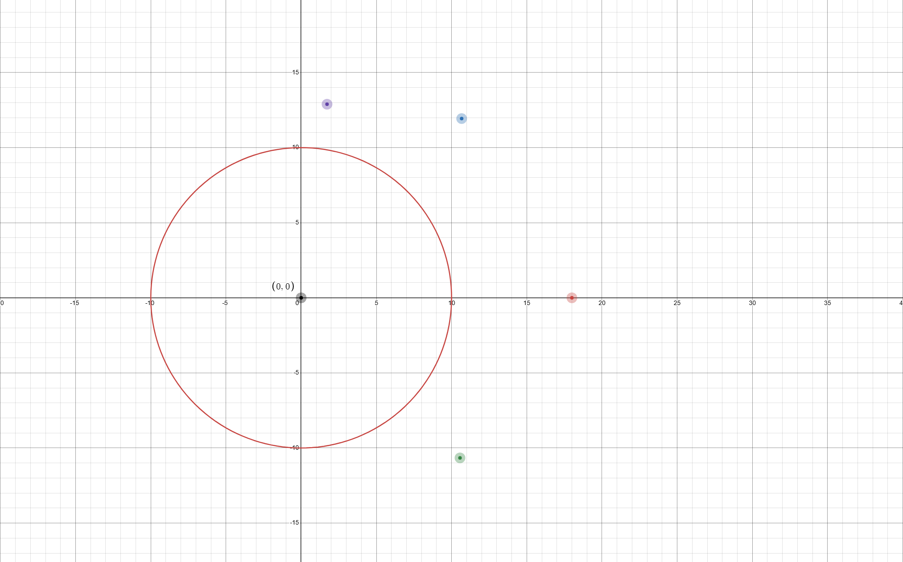
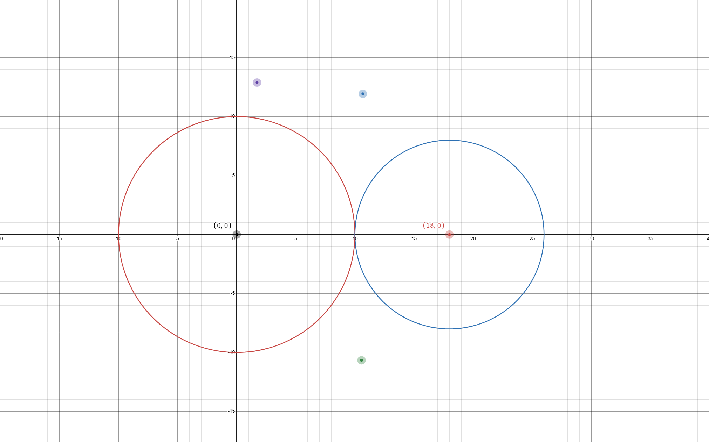
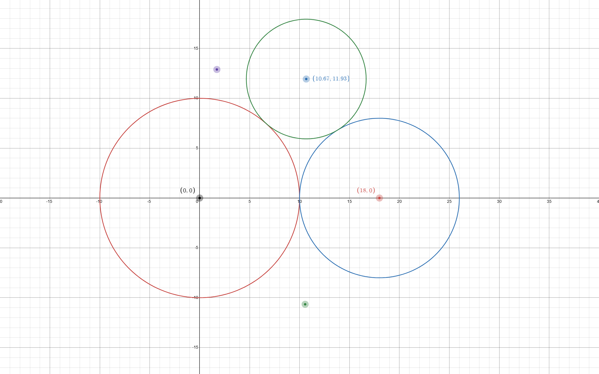
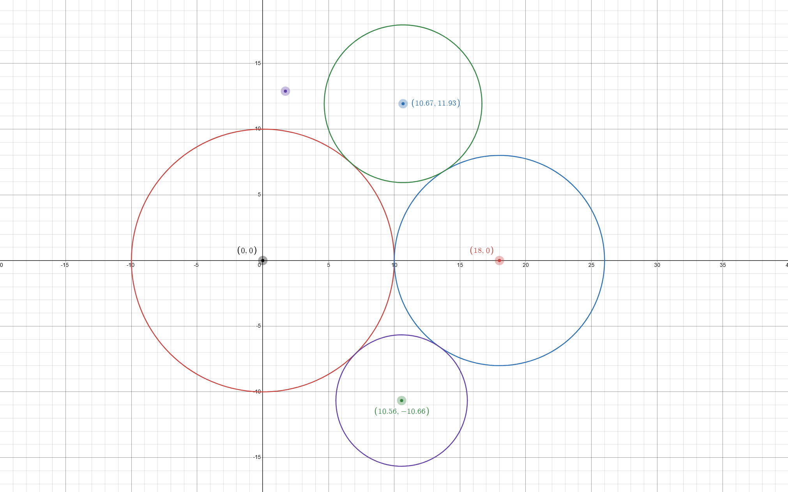
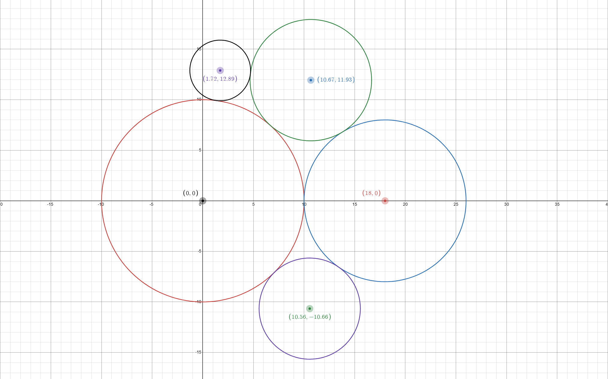
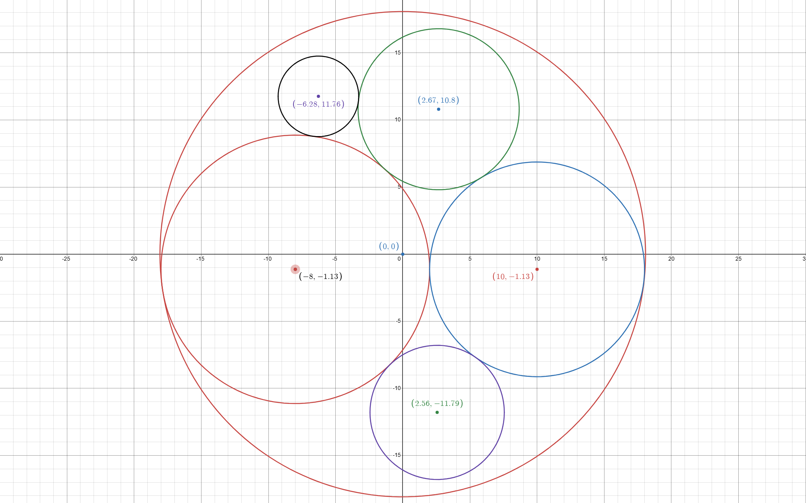

# WirePackingSolver - Algorithm Documentation

## 1. Purpose

`WirePackingSolver` places a set of circular wires (given by their radii) into a non-overlapping
bundle and reports the radius and diameter of the resulting enclosing circle. The solver is
**heuristic**, not exact: it builds the bundle incrementally, placing one wire at a time in the
best currently-available position, then recenters the final layout.

This document explains the algorithm in production terms and gives a fully worked example using a
single, deterministic insertion order: **descending order (`DESC`)**.

---

## 2. Data model

| Type | Role |
|---|---|
| `InputData` | Holds the input list of radii. |
| `WirePlacement` | Represents one placed wire: `Radius`, `X`, `Y`, and solver-only `TangentCount`. |
| `BundleResult` | Holds the final list of placed wires and the resulting `BundleRadius` / `BundleDiameter`. |

---

## 3. Services and core logic

These are the main services that implement the solver, I/O, rendering, and benchmarking.

| Type / File                | Role                                                                                 |
|----------------------------|--------------------------------------------------------------------------------------|
| `WirePackingSolver`        | Core packing algorithm service: generates candidates, filters overlaps, scores and selects placements, recenters the layout, computes bundle radius/diameter. |
| `InputParser`              | Service that reads and validates input text files, parses radii, and populates `InputData`. |
| `BundleRenderer`           | Service that renders the final bundle layout (wires and enclosing circle) in the WPF UI. |
| `BENCHMARK`                | Benchmark harness entry point; drives bulk runs of `WirePackingSolver` over many inputs and parameter combinations. |
| `BenchmarkConfig`          | Holds benchmark configuration (insertion orders, solver parameter sweeps, input sets). |
| `Logger`, `AppLog`, `LogLevel` | Logging infrastructure: structured log messages for solver steps, parsing, benchmarking, and rendering. |

---

## 4. Project structure

| Folder / File              | Purpose                                                                             |
|----------------------------|--------------------------------------------------------------------------------------|
| `WirePackingSolver.cs`     | Core packing algorithm and solver service (`WirePackingSolver`).                    |
| `WirePlacement.cs`         | Data model for a single placed wire (radius, position, tangent count).             |
| `InputData.cs`             | Data model for parsed input radii.                                                  |
| `BundleResult.cs`          | Data model for the full bundle (placements + radius/diameter).                     |
| `InputParser.cs`           | Service for reading and validating input files into `InputData`.                    |
| `BundleRenderer.cs`        | Service for drawing the bundle in the WPF UI.                                       |
| `BENCHMARK.cs`             | Benchmark harness that runs the solver over multiple configurations (Debug only).   |
| `BenchmarkConfig.cs`       | Benchmark configuration: parameter sets, insertion orders, input file list.        |
| `Logger.cs`, `AppLog.cs`, `LogLevel.cs` | Logging services and log-level enum used across the app.              |
| `MainWindow.xaml` / `.xaml.cs`    | Main application window: file loading, single-run solver UI.              |
| `BenchmarkWindow.xaml` / `.xaml.cs`| Benchmark UI (Debug only): parameter sweep controls, results grid, CSV export. |

## 5. Solver overview

For a chosen insertion order, the solver executes the following steps:

1. Place the first wire at the origin.
2. Place the second wire tangent to the first along the positive X axis.
3. For each remaining wire:
   - generate candidate placements,
   - remove duplicates,
   - discard overlaps,
   - score the remaining candidates,
   - select the best one.
4. Recenter the final layout around the origin using the bounding-box midpoint.
5. Compute the final bundle radius and bundle diameter.

The solver uses the following candidate families for each new wire:

- **Fallback candidates around one wire**: place the new wire tangent to one already-placed wire
  at sampled angles.
- **Tangent-to-two candidates**: place the new wire at a position tangent to two already-placed
  wires using circle-circle intersection geometry.

Candidate ranking is based primarily on the resulting **bundle radius** (smaller is better). If two
candidates are equal within `Epsilon`, the solver prefers the one tangent to a larger number of
already-placed wires (`TangentCount`).

---

## 6. Key constants and parameters

| Parameter | Meaning |
|---|---|
| `Epsilon = 1e-6` | Floating-point tolerance used for equality, tangency, and deduplication. |
| `FallbackDirectionCount` | Number of sampled angles for fallback one-wire candidates. |
| `CoarseSurvivorCount` | Number of best fallback directions kept for refinement. |
| `FineAngularOffsetDegrees` | Fine-angle refinement offset for fallback candidates. |
| `MaxCandidateCount` | Size of the bounded top-k list used during final scoring. |

---

## 7. Placement rules

### 7.1 First wire

The first wire is always placed at:

```text
X = 0
Y = 0
```

### 7.2 Second wire

The second wire is always placed tangent to the first on the positive X axis:

```text
X = firstWire.Radius + newWire.Radius
Y = 0
```

### 7.3 Remaining wires

For every later wire, the solver calls `FindBestWirePlacement`.

That method:

1. Computes the current bundle radius.
2. Generates all fallback candidates around each placed wire.
3. Generates all tangent-to-two candidates for every pair of placed wires.
4. Deduplicates candidates on an `Epsilon` grid.
5. Filters out overlapping candidates.
6. Computes each valid candidate's `TangentCount`.
7. Scores candidates by bundle radius, then by tangent count.
8. Returns the best-scoring placement.

---

## 8. Geometry used by the solver

### 8.1 Bundle radius

For a placed wire at `(x, y)` with radius `r`, its required enclosing radius is:

```text
sqrt(x² + y²) + r
```

The bundle radius for the whole layout is the maximum of that value across all wires.

### 8.2 Fallback candidate around one wire

If an already-placed wire has center `(px, py)` and radius `pr`, and the new wire has radius `nr`,
then for a sampled angle `θ` the candidate center is:

```text
distance = pr + nr
x = px + distance * cos(θ)
y = py + distance * sin(θ)
```

### 8.3 Tangent-to-two candidate

Let:

- wire A center = `(ax, ay)`, radius `ar`
- wire B center = `(bx, by)`, radius `br`
- new wire radius = `nr`

The new center must lie:

- `ar + nr` away from A, and
- `br + nr` away from B.

This is solved as a circle-circle intersection problem.

Definitions:

```text
d1 = ar + nr
d2 = br + nr
D  = distance between A and B centers
```

Projection distance from A along the A->B line:

```text
a = (d1² - d2² + D²) / (2D)
```

Perpendicular offset:

```text
h² = d1² - a²
h  = sqrt(max(0, h²))
```

Projection point:

```text
projection = A + a * (B - A) / D
```

Perpendicular offset vector:

```text
offset = h * rotate90(B - A) / D
```

Solutions:

```text
candidate1 = projection + offset
candidate2 = projection - offset
```

If `h` is approximately zero, the two solutions collapse into one.

---

## 9. Worked example: 5 circles

Radii chosen (deliberately varied, to produce interesting tangent geometry): **10, 8, 6, 5, 3**
(mm). All numbers in this section are taken directly from one actual
application run using the descending (`DESC`) insertion order.

---

### 9.1 Insertion order

Insertion order for this example:

```text
DESC = 10, 8, 6, 5, 3
```

---

### 9.2 Wire 1 (r = 10) — first circle

First wire rule:

```text
(0.00, 0.00)
```

The first wire is placed at the origin.



---

### 9.3 Wire 2 (r = 8) — second circle

Second wire rule:

```text
X = 10 + 8 = 18
Y = 0
```

Placement:

```text
(18.00, 0.00)
```

The second wire is tangent to the first along the positive X axis.



Current bundle radius:

```text
max( sqrt(0² + 0²) + 10,
     sqrt(18² + 0²) + 8 )
= max(10, 26)
= 26.00
```

---

### 9.4 Wire 3 (r = 6) — third circle

The solver generates candidates around the two already-placed wires and via tangent-to-two
geometry, deduplicates them, filters out overlaps, and scores the survivors.

Selected placement:

```text
(10.67, 11.93)
```

Bundle radius after placement:

```text
26.00
```



---

### 9.5 Wire 4 (r = 5) — fourth circle

For the fourth wire, fallback and tangent-to-two candidates are generated against all three
already-placed wires. After deduplication and overlap filtering, the solver again selects the
best candidate by bundle radius (with tangent-count tie-break).

Selected placement:

```text
(10.56, -10.66)
```

Bundle radius after placement:

```text
26.00
```



---

### 9.6 Wire 5 (r = 3) — fifth circle

For the fifth wire, fallback and tangent-to-two candidates are generated against all four
already-placed wires. The candidate that fits inside the existing bundle radius and has the
highest tangent count is preferred.

Selected placement:

```text
(1.72, 12.89)
```

Bundle radius after placement:

```text
26.00
```



---

### 9.7 Pre-recentering coordinates (five circles)

Before recentering, the layout is:

| Wire | Radius | X    | Y      |
|------|--------|------|--------|
| 1    | 10.00  | 0.00 | 0.00   |
| 2    | 8.00   | 18.00| 0.00   |
| 3    | 6.00   |10.67 |11.93   |
| 4    | 5.00   |10.56 |-10.66  |
| 5    | 3.00   | 1.72 |12.89   |

---

### 9.8 Recentering and final bundle circle

The solver computes the bounding box of all wires (center ± radius) and recenters the layout
around the midpoint:

```text
centerX = 8.00
centerY = 1.13
```

Each wire is shifted by `(-8.00, -1.13)`, and the enclosing bundle circle is drawn with radius
equal to the final bundle radius.

Final coordinates and bundle:

| Wire | Radius | Final X | Final Y |
|------|--------|---------|---------|
| 1    | 10.00  | -8.00   | -1.13   |
| 2    | 8.00   | 10.00   | -1.13   |
| 3    | 6.00   |  2.67   | 10.79   |
| 4    | 5.00   |  2.56   | -11.79  |
| 5    | 3.00   | -6.28   | 11.75   |



The enclosing circle (bundle) has:

```text
BundleRadius ≈ 18.08
BundleDiameter ≈ 36.16
```

This matches the solver output for the `DESC` order.

---

## 10. Production notes

### 10.1 What the solver guarantees

- No two placed wires overlap.
- Every chosen placement is valid with respect to already-placed wires.
- The returned diameter is internally consistent with the final coordinates.
- The algorithm is deterministic for a fixed input and fixed parameter set.

### 10.2 What the solver does not guarantee

- It does **not** guarantee the globally optimal packing.
- It does **not** solve the weighted smallest-enclosing-circle problem exactly.
- Final recentering uses the bounding-box midpoint, which is simple and stable, but not guaranteed
  to be the mathematically optimal enclosing-circle center.

### 10.3 Why this is acceptable

The solver is intentionally designed as a practical heuristic:

- it is straightforward to reason about,
- it avoids unnecessary duplicate work,
- it is readable and maintainable,
- it produces consistent, high-quality layouts quickly.

That makes it appropriate for use in this application, where predictability,
maintainability, and good practical results are more important than exact global optimality.
